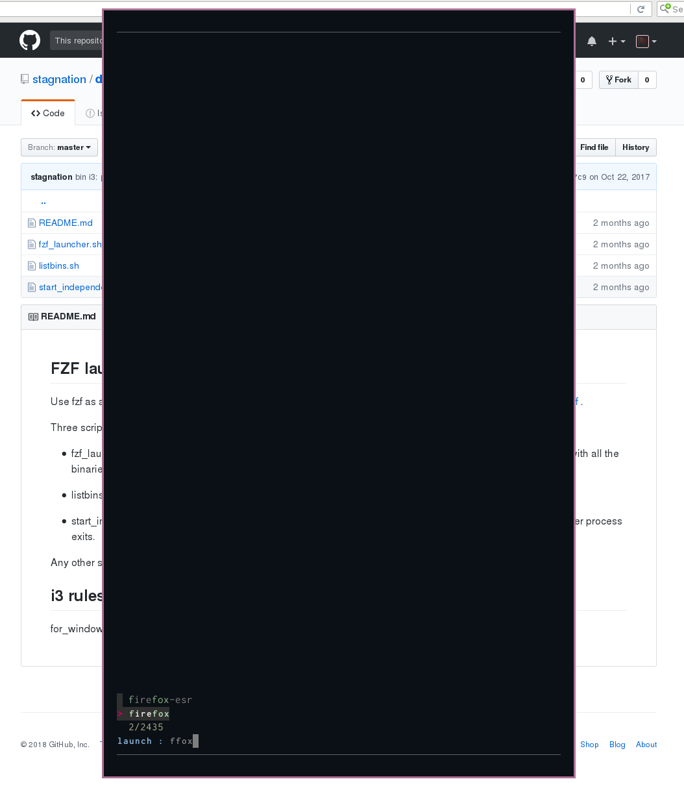

FZF launcher
------------

Use fzf as a launcher similar to dmenu.
As per https://medium.com/njiuko/using-fzf-instead-of-dmenu-2780d184753f .

Three scripts are composed as well as some i3 rules to display the launcher in a
floating terminal.

* fzf_launcher.sh
    the launcher, creates a new terminal window with a specific window class.
    This populates fzf with all the binaries in $PATH and launches the selection

* listbins.sh
    prints all binaries in $PATH

* start_independent_process.py
    start a process in the background and disowns it so it survives when the
    launcher process exits.

Any other script can be used to populate the floating fzf selector and the
selection can be put to use with any script.

i3 rules
--------

for_window [class = "URxvt" instance = "UrxvtFloat$"] floating enable

screenshot
==========

