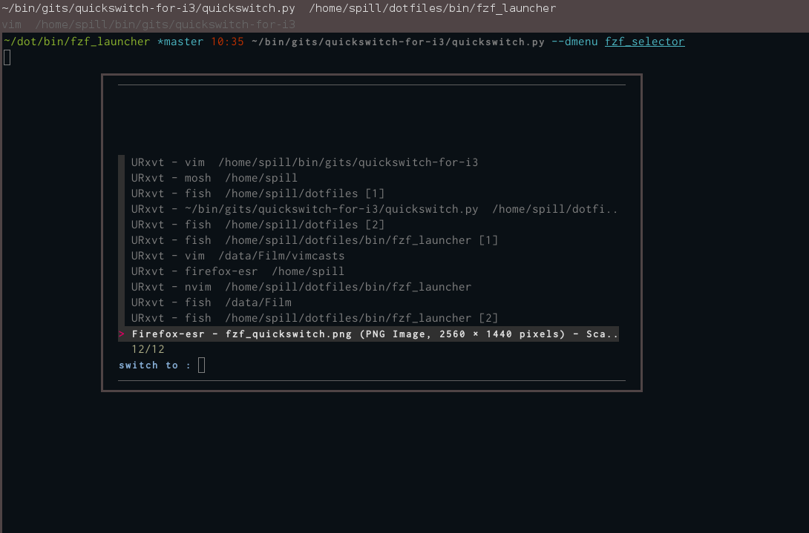

Overview
========

This project uses fzf in a floating terminal to replace dmenu in several
use-cases. The benefit is to use the same fuzzy-matching algorithm in all
applications. From the shell, in vim and when navigating windows with
quickswitch: https://github.com/OliverUv/quickswitch-for-i3/

* FZF_launcher is technically a subset of the FZF_selector.
$ listbins.sh | fzf_selector | xargs start_independent_process.py

FZF launcher
============

Use fzf as a launcher similar to dmenu_run.
As per https://medium.com/njiuko/using-fzf-instead-of-dmenu-2780d184753f .

Three scripts are composed as well as some i3 rules to display the launcher in a
floating terminal.

* fzf_launcher.sh
    the launcher, creates a new terminal window with a specific window class.
    This populates fzf with all the binaries in $PATH and launches the selection

* listbins.sh
    prints all binaries in $PATH

* start_independent_process.py
    start a process in the background and disowns it so it survives when the
    launcher process exits.

Any other script can be used to populate the floating fzf selector and the
selection can be put to use with any script.

i3 rules
--------

for_window [class = "URxvt" instance = "UrxvtFloat$"] floating enable

screenshot
----------

FZF_selector
============

Use fzf as a selector similar to dmenu

In addition to the settings from FZF_launcher this accepts input from standard
input and populates fzf with entries from any command. The output from fzf is
saved to a file and later output from the selector after the terminal with fzf
exits.

usage combined with quickswitch
-------------------------------
quickswitch: https://github.com/OliverUv/quickswitch-for-i3/

`
$ quickswitch.py --dmenu fzf_selector <extra arguments>
`

screenshot
----------

